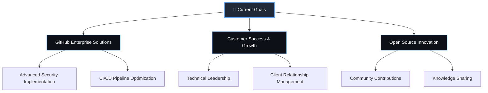

# 💫 Jack G Kafaty

<div align="center">
  
  

</div>

## 🚀 About Me

```yaml
name: "Jack G Kafaty"
role: "Senior Solutions Engineer @ GitHub"
location: "Orlando, FL 🏖️"
experience: "9+ years in enterprise solutions"
passionate_about: 
  - "Cloud Architecture & DevOps"
  - "Enterprise Solutions Design"
  - "Customer Success & Technical Leadership"
  - "Open Source Contributions"
current_focus: "Driving innovation in GitHub Enterprise"
```

<div align="center">

### 🌟 **Making the impossible, possible through code** 🌟

</div>

---

## 🛠️ Tech Arsenal

<div align="center">

### ☁️ **Cloud & Infrastructure**


### ⚡ **DevOps & Automation**


### 💻 **Development**


### 🛢️ **Databases & Tools**


</div>

---

## 📊 GitHub Analytics

<div align="center">
  
  
</div>

<div align="center">
  
</div>

---

## 🎯 Current Focus

<div align="center">



</div>

---

## 🏆 Professional Achievements

<div align="center">

| 🎖️ **Achievement** | 📈 **Impact** | 🎯 **Year** |
|:---:|:---:|:---:|
| 🔒 **GitHub Advanced Security** | Fortified enterprise security | 2023-2024 |
| 📊 **Customer Adoption Growth** | Enhanced product adoption | 2023 |
| 🌟 **Solutions Architecture** | Streamlined enterprise workflows | 2021-2023 |
| 💰 **Revenue Generation** | $1.2M+ in client solutions | 2019-2022 |

</div>

---

## 📬 Connect With Me

<div align="center">

[](https://linkedin.com/in/jackgkafaty)
[](https://github.com/jackgkafaty)
[](mailto:jackgkafaty@gmail.com)

</div>

---

<div align="center">

### 💭 *"Innovation distinguishes between a leader and a follower."* - Steve Jobs


⭐ **Thanks for visiting!** ⭐

</div>

<div align="center">
  
</div>

